This is ChlorophyII's LaTeX package. 

It takes five minutes to set up and another five minutes to know how to use it. Hope it can save you a lot more time.

`\usepackage{ChlorophyII}`

## Highlights
1. Zenburn mode: Add `\zenburn` somewhere before `\begin{document}`. Compile. Protect your eyes.
2. Auto-brackets: Try `\abrr{\abrr{\abrr{1+1}^{p+1}}+\frac{/pi^2}{6}}`. It will automatically increase its size depending on its contents.  
	However, `\abrr{\abrr{1+1}+1}` does not look good, for the outer braces  are as small as the inner ones. In that case, use `\abrr[big]{\abrr{1+1}+1}` instead. *big* can be replaced by *normal*, *Big*, *bigg* and *Bigg*.  
	`\abrs` and `\abrc` work exactly the same way as `\abrr`, except that they give square and curly brackets respectively.  
3. Finite-series: `\series` generates the expanded form of the finite sum of a series from its expression of the nth-term. It liberates you from repeatedly typing awkward LaTeX expressions. Look at it!  
	<div align="center">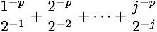</div>  
	
	Instead of `\frac{1^{-p}}{2^{-1}}+\frac{2^{-p}}{2^{-2}}+\cdots+\frac{j^{-p}}{2^{-j}}`, you just need `\series[j]{\frac{\n^{-p}}{2^{-\n}}}`. Fewer characters are good, but the real power of `\series` unfolds when you want to change the term a little bit. Say, if you want to associate `p` with an index, you can simply replace `p` by `p_\n`. 
		See <a href="#examples">examples</a> for more information.

## Installation
### macOS
```shell
cd ~/Library
mkdir -p texmf/tex/latex
cd texmf/tex/latex
git clone https://github.com/ChlorophyII/LaTeX-ChlorophyII.git
cd ../..
texhash
```
Haven't installel git?

```shell
/usr/bin/ruby -e "$(curl -fsSL https://raw.githubusercontent.com/Homebrew/install/master/install)"
brew install git
```

### Other systems
Look at [this question](https://tex.stackexchange.com/questions/1137/where-do-i-place-my-own-sty-or-cls-files-to-make-them-available-to-all-my-te) on TeX exchange.

## <a id="examples"></a>Examples
1. `\NN, \ZZ, \QQ, \RR, \CC`  
	<div  align="center">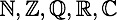</div>  
	
2. `\Re{z}, \Im{z}`  
	<div  align="center">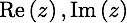</div>  
	
3. `\abs{x-y},\norm{f-g}`  
	<div  align="center">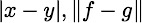</div>  

4. `apmatrix` and `abmatrix` are augmented pmatrix and bmatrix. The arguments are the number of columns before and after the vertical line.

   ```tex
   DF=
   \begin{apmatrix}{3}{3}
     \dfrac{\partial F_1}{\partial x_1} & \cdots & \dfrac{\partial F_1}{\partial x_n} & \dfrac{\partial F_1}{\partial y_1} & \cdots & \dfrac{\partial F_1}{\partial y_m}\\
     \vdots & \ddots & \vdots\ & \vdots & \ddots & \vdots\\
     \dfrac{\partial F_m}{\partial x_1} & \cdots & \dfrac{\partial F_m}{\partial x_n} & \dfrac{\partial F_m}{\partial y_1} & \cdots & \dfrac{\partial F_m}{\partial x_n}
   \end{apmatrix}
   =
   \begin{apmatrix}{1}{1}
     D_{\mathbf{x}}F&D_{\mathbf{y}}F
   \end{apmatrix}
   ```
    <div  align="center">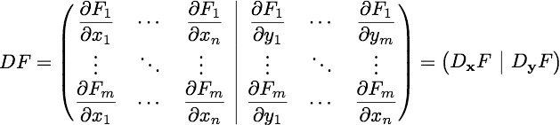</div>  

4. Auto-brackets:  
	It is convenient to use `\abrr`, `\abrs` and `\abrc` in a lot of situations. It helps you easily adjust the size of brackets and gives your code better structure.  
	`\abrr{\abrr{\abrr{1+1}^{p+1}}+\frac{\pi^2}{6}}`  
	<div  align="center">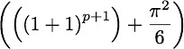</div>  
	
	`\abrr{\abrr{1+1}+1}` produces bad typesetting  
	<div  align="center">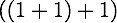</div>  
	
	`\abrr` can take one argument like `\abrr[big]{\abrr{1+1}+1}`  
	<div  align="center">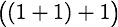</div>  
	
	*big* can be replaced by *normal*, *Big*, *bigg* or *Bigg*.  
	`\abrs` and `\abrc` work exactly the same way as `\abrr`, except that they give square and curly brackets respectively.  
	`\abrc[Big]{a\in\RR:\abrs{\sin\abrr[normal]{x+x^2}}_0^a\ge0}`  
	<div  align="center">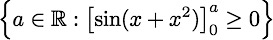</div>  
	
5. Finite-series:  
	It takes three optional and one required arguments. The syntax is  
	`\series[index][starting index][delimiter]{general term}`.  
	By default, *index* is n, *starting index* is 1, and *delimiter* is +. Optional arguments must be input in order. If you want to change the delimiter, you must type in *index* and *starting index*. *starting index* can be either 1 or 0. In *general term*, `\n` is used as a placeholder for the index.  
	`\series{a_\n}`  
	<div  align="center">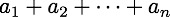</div>  
	
	`\series[j]{\frac{\n^{-p}}{2^{-\n}}}`
	<div  align="center"></div>  
	
	`\series[m][0]{x_\n}`  
	<div  align="center">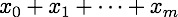</div>  
	
	`a=\series[k][0][<]{c_\n}=b`  
	<div  align="center">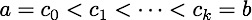</div>  
	
	`\series[n][1][,]{\n}`  
	<div  align="center">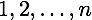</div>  
	
6. Theorems, definitions and remarks:  
	*definition*, *lemma*, *proposition*, *theorem*, *corollary*, *conjecture*, *example*, *remark*, *note* and *fact* are environments, and they are used in the same way. You may or may not give a name to the theorem or definition or...

	```tex
	\begin{theorem}[Fermat's Last Theorem]
	No three positive integers $a$, $b$, and $c$ satisfy the equation $a_n+b_n=c_n$ for any integer value of $n$ greater than $2$.
	\end{theorem}
	```
	<div  align="center"></div>  
	
